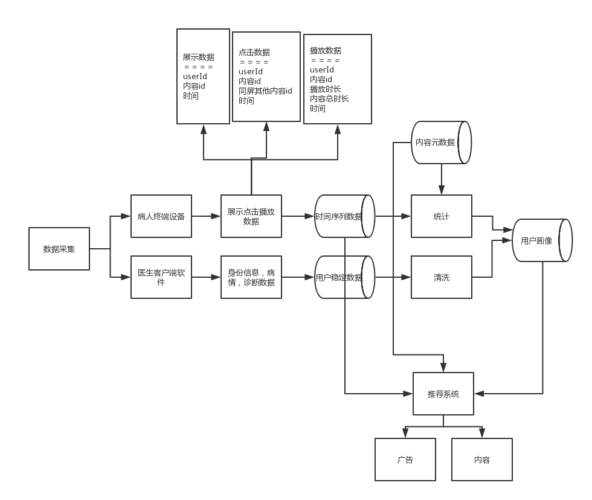
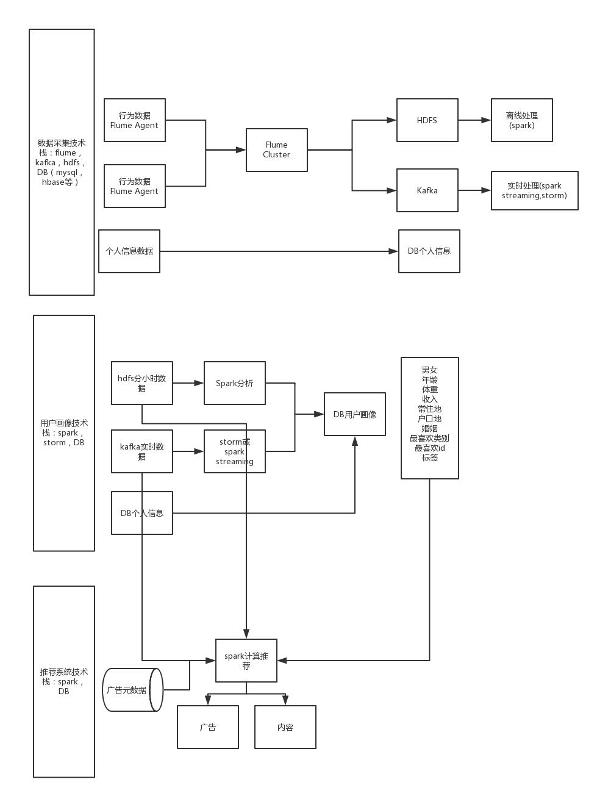

## 医疗数据平台
* 场景：
	* 同一个设备会被多人使用，但每个用户使用时间就几天
	* 用户每天使用时间会很长
	* 根据对当前用户的了解，给其推荐合适的内容和合适的广告
* 平台功能：
	* 数据采集，ETL存储
	* 数据分析，用户画像
	* 推荐系统

### 平台框架分析
1. 该平台数据来源于*两部分*：一部分是静态数据，用户在入院时的个人信息，检查时的检查信息，以及医生诊断后的诊断信息；另一部分是用户在病床上使用终端设备时的行为数据。这两部分数据在进入数据库时可用完全独立，仅用userId关联即可（由于一个终端设备会被多个用户使用，所以使用时用户id非常重要，它代表了该终端的真实用户）。
2. 用户画像需要用到用户在使用终端设备时内容的元数据信息，然后根据各个维度进行数据挖掘和用户画像分析。用户画像的内容需要分析人员根据实际情况进行分析统计。
3. 推荐系统，有了用户个人信息，用户行为数据，内容元数据，就可以对用户进行内容推荐了。推荐的内容可用是内容，也可以是广告。

### 自建平台技术栈分析
看图即可

### 商业平台技术栈分析
 [阿里云大数据平台](https://data.aliyun.com/product/product_index?utm_medium=text&utm_source=baidu&utm_campaign=dsj&utm_content=se_383866)：
 存储，画像分析，数据可视化，推荐引擎都有
 
 [微软数据平台] (http://www.microsoft.com/zh-cn/server-cloud/solutions/data-warehouse-big-data.aspx?wt.mc_id=AID529507_SEM_EMT-MSFT_ZH_CEServer_China_Search-Baidu0240)：数据仓库很牛逼，分析起来很快，支持云端也支持落地
 
 还有一些大数据技术支持的公司，帮助你在公司内部搭建一套大数据平台并提供简要的技术培训（这事其实我也能做）。
