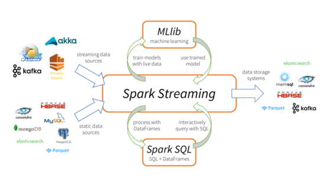

# spark streaming简介
*总的来说就是一个能实时处理非常大数据量的分布式框架*

## 使用场景

### 1. 分布式日志分析（通过sql处理实时日志）
1. 风控：某个ip在一个窗口中的访问次数
2. 统计：统计每个URL在最近一分钟的访问次数,平均耗时
3. 实时转化率

### 2. 分布式实时算法（近实时使用spark mlib中的各种算法）
1. 用户特征计算
2. 推荐系统计算
3. 其他mlib给的算法

## 基本原理
[官方原理](http://spark.apache.org/docs/latest/streaming-programming-guide.html)  
[中文原理](http://ifeve.com/spark-streaming-2/)  
[csdn](http://m.blog.csdn.net/article/details?id=49047785)

## 功能特性
易扩充，低延迟，有效的错误恢复，易集成到和交互处理  
[streaming](http://spark.apache.org/streaming/)

## 相关技术比较
[flink](https://flink.apache.org/)  
[storm](http://storm.apache.org/)  
[storm vs sparkStreaming](http://kakack.github.io/2015/10/Spark-Streaming%E4%B8%8EApache-Storm%E8%AF%A6%E7%BB%86%E6%AF%94%E8%BE%83/)
